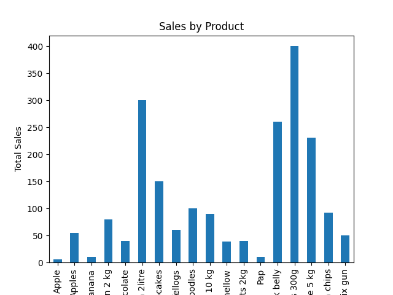

# MiniPOS Python 🛒

A **console-based Point-of-Sale (POS) system** built with Python OOP, MySQL, CSV, Pandas, and Matplotlib.  
This project simulates a real grocery store checkout and tracks sales data with analytics.

[](https://www.python.org/)
[](LICENSE)

---

## ✨ Features

- **User Input Validation**: Robust cashier/customer/product input with error handling
- **Receipt Generation**: Automatic total calculation and change computation
- **Dual Persistence**: Saves sales to both CSV files and MySQL database
- **Sales Analytics**: Generate bar charts and summaries using Pandas & Matplotlib
- **Environment Configuration**: Secure database credentials via environment variables
- **Beginner-Friendly**: Clean OOP design, easy to understand and extend

---

## 📸 Screenshots

### Sample Receipt Output
```
====== RECEIPT ======
Cashier: John Doe
Customer: Jane Smith
---------------------
Apples x2 = R10.00
Bananas x1 = R5.00
---------------------
TOTAL: R15.00
```

### Sales Analytics Chart


---

## 🚀 Installation & Setup

### Prerequisites
- Python 3.8 or higher
- MySQL Server (local or remote)
- Git

### 1. Clone the Repository
```bash
git clone https://github.com/Musawenkosi10/MiniPOS-Python.git
cd MiniPOS-Python
```

### 2. Install Dependencies
```bash
pip install -r requirements.txt
```

### 3. Setup MySQL Database
1. Create a database named `minipos`:
   ```sql
   CREATE DATABASE minipos;
   ```

2. Run the provided schema:
   ```sql
   -- Execute the contents of database.sql
   ```

3. Set environment variables for database connection:
   ```bash
   # Windows
   set DB_HOST=localhost
   set DB_USER=root
   set DB_PASSWORD=your_password
   set DB_NAME=minipos

   # Or create a .env file (install python-dotenv first)
   ```

### 4. Run the Application
```bash
# Start the POS system
python main.py

# Run analytics (after some sales data)
python run_analytics.py
```

---

## 📖 Usage

1. **Run POS System**:
   - Enter cashier and customer names
   - Add products (name, quantity, price)
   - Enter payment amount
   - View receipt and change

2. **View Analytics**:
   - Run `python run_analytics.py`
   - See sales summary and bar chart

### Sample Interaction
```
====== MiniPOS System ======
Enter cashier name: John
Enter customer name: Jane
How many products? 2

Product 1
Product name: Apples
Quantity: 2
Price: 5.00

Product 2
Product name: Bananas
Quantity: 1
Price: 5.00

Customer payment: 20.00
Change: 10.00
Sales saved!
```

---

## 🗂️ Project Structure

```
MiniPOS-Python/
├── main.py              # Main POS application
├── product.py           # Product model
├── receipt.py           # Receipt generation
├── database.py          # MySQL database operations
├── analytics.py         # Sales analytics
├── run_analytics.py     # Analytics runner
├── requirements.txt     # Python dependencies
├── database.sql         # MySQL schema
├── data/
│   └── sales.csv        # CSV sales data
├── charts/
│   └── sales_chart.png  # Generated charts
└── README.md
```

---

## 🛠️ Technologies Used

- **Python 3.8+**: Core language
- **MySQL Connector**: Database operations
- **Pandas**: Data analysis
- **Matplotlib**: Chart generation
- **CSV**: File-based data storage

---

## 🤝 Contributing

1. Fork the repository
2. Create a feature branch (`git checkout -b feature/amazing-feature`)
3. Commit your changes (`git commit -m 'Add amazing feature'`)
4. Push to the branch (`git push origin feature/amazing-feature`)
5. Open a Pull Request

---

## 📄 License

This project is licensed under the MIT License - see the [LICENSE](LICENSE) file for details.

---

## 🙋‍♂️ Support

If you have any questions or issues, please open an issue on GitHub or contact the maintainer.

---

**Made with ❤️ by Musawenkosi Mkhatjwa**
